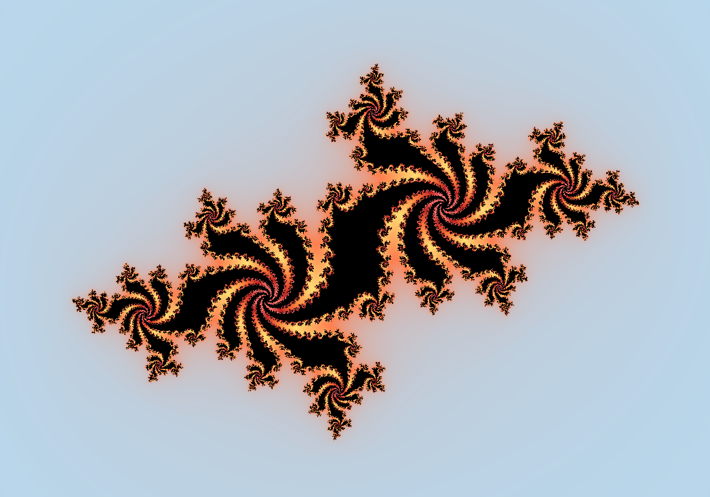
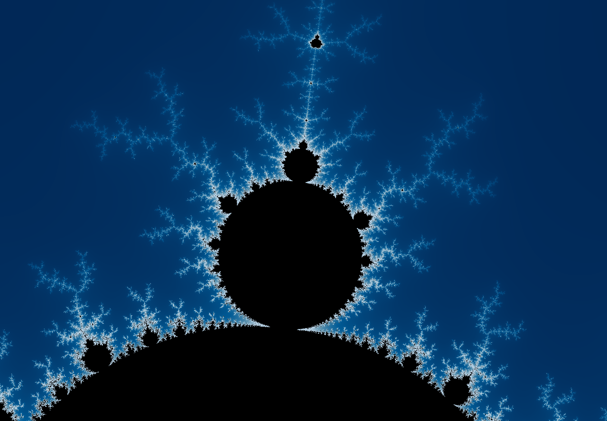
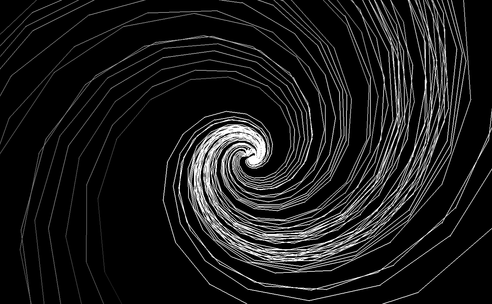
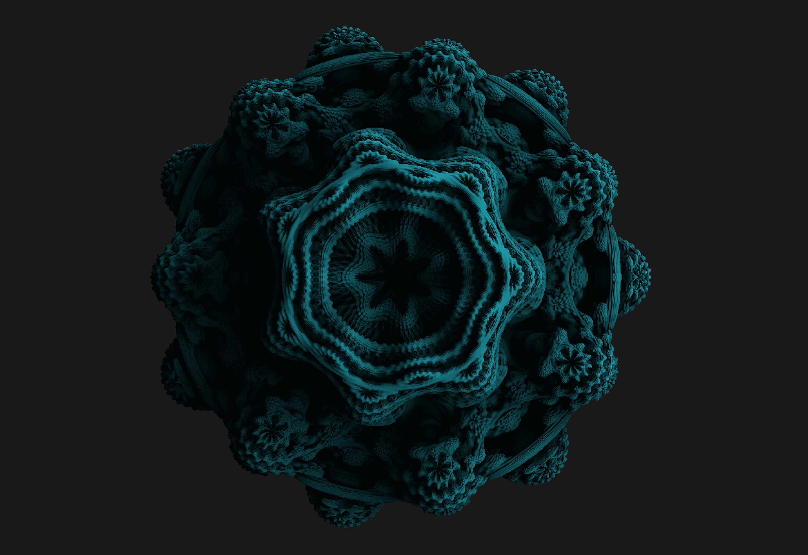
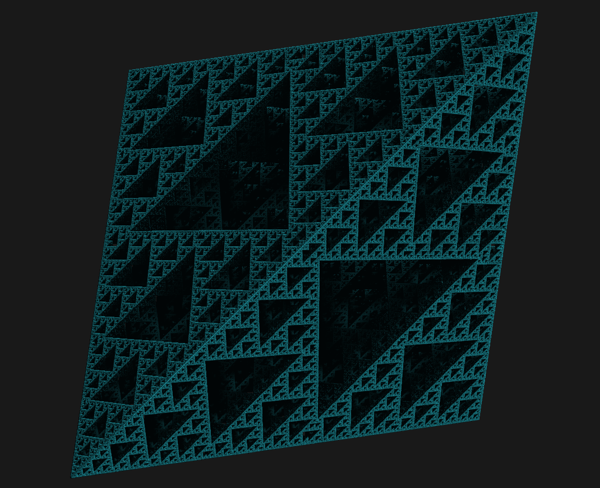

# Fractal

In mathematics, a fractal is a subset of a Euclidean space for which the Hausdorff dimension strictly exceeds the topological dimension.

## Pictures







## Features

- 2D Fractals
- 3D Fractals (Using Ray Marching)
- OpenCl

## Compilation

Use Makefile to run the project.

```bash
make

./fractol
```

## Usage

Buttons:
```bash
Use scroll to make picture bigger or smaller
Press 'P' to change colors

8 - 2D Julia (Press 'C' and move mouse to change)
9 - 2D Mandelbrot
0 - Ikido (Press 'Q' or 'E' to move)
```

Be careful, they can kill your computer:
```bash
2 - Box
4 - Tetrahedron
5 - 3D Mandelbrot
6 - Mandelbulb
7 - 3D Julia
```

## Additional information

Realization language: C
Libraries: minilibx

## Amazing page about fractals
[Click here](https://sunandstuff.com/mandelbrot/about/)

